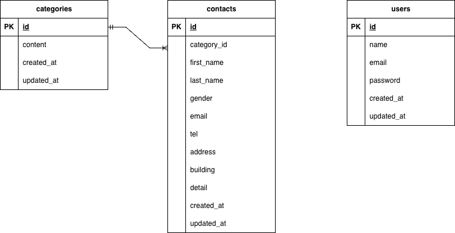

# プロジェクト名：お問い合わせフォーム (test_contact-form)

## 動作環境 / 使用技術
- HTML/CSS
- PHP 8.1
- Laravel 8.x
- JavaScript（モーダル表示・非表示の制御に最低限使用）
- MySQL 8.0.26
- nginx 1.21.1
- Docker / Docker Compose

## Dockerビルド
- git clone https://github.com/S-Uchiyama/test_contact-form
- cd test_contact-form
- docker-compose up -d --build

## Laravel環境構築
- docker-compose exec php bash
- composer install
- cp .env.example .env  環境変数を適宜変更
- php artisan key:generate
- php artisan migrate

## 開発環境
- お問い合わせ画面：http://localhost/
- ユーザー登録画面：http://localhost/register
- ログイン画面：http://localhost/login
- 管理者画面：http://localhost/admin
- phpMyAdmin：http://localhost:8080/

## ER図
